# EGSE Documentation
The Electronic Ground Support Equipment consists of a user's host computer, to run and host YAMCS and to run programs to handle and transport incoming data to YAMCS. 

The current version of the software contains a configured build of YAMCS, a custom created XTCE database made with the Opus2 Tool and a spacecraft simulator program to represent simple behaviour of a spacecraft.

All of this software is available on Github at the link: **https://github.com/KISPE-Space/mbep-cdr-quickstart**

This repository contains the aforementioned software and this documentation.

The guide includes steps for the user to:
- Download and run the YAMCS instance tailored for the MBEP CDR
- Run the spacecraft simulator program
- View incoming telemetry and send commands to the simulator

## Setup
this software configuration assumes the physical setup as shown below:

<p align="center">
  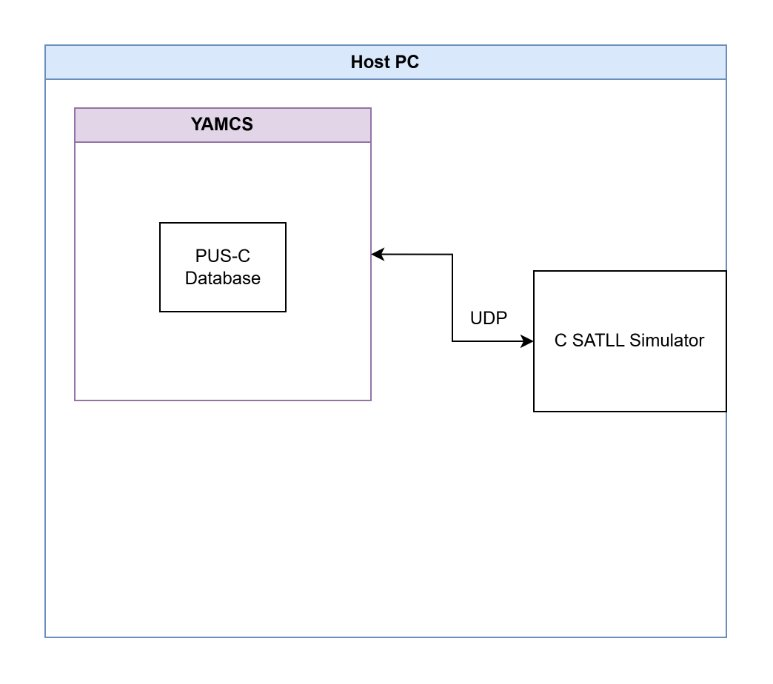
</p>

All that is required is a host PC as this example is primarily software based. This software and setup has been tested and ran on Ubuntu systems and is known to work. YAMCS can be run on windows but it has not been tested in this configuration.

## YAMCS
### Install Script
Provided in the repo in `/scripts` are three bash scripts.
The script `install-yamcs.sh` installs the adapted version of YAMCS to work for the CDR. 

To run the install script, in the same directory as the `.sh` file, in a terminal enter:
```bash
bash install-yamcs.sh
```
or it can be run with
```bash
chmod +x install-yamcs.sh # Only ever need to run once
./install-yamcs.sh
```

This will default to installing the GitHub repo to the user's `/home/USERNAME/egse` directory. This is default but can be adpated by editing the script itself. The script will then extract the required files and YAMCS is ready to run.

#### Running YAMCS
YAMCS can be run with the script `run-yamcs.sh` assuming the previous install script has been run. Note if you adapt the install script to install to a different location, the run script will also need to be updated.
```bash
bash run-yamcs.sh
```

To run YAMCS alongside the `satll-simulator` run the command:
```bash
bash egse_run_simulator.sh
```
Where the YAMCS log output will be displayed in a new terminal alongside the simulator output.


### Manually Installing YAMCS
YAMCS has been precompiled and available at the repo mentioned. The files provided also allow a user to customise and recompile the project if desired.

The YAMCS instance is packaged as `mbep-cdr-yamcs-0.0.1-CDR-bundle.tar.gz` which can be extracted and ran.

The code can be downloaded by selecting the `Code` button and downloading as a `.zip` which can be decompressed or by cloning the git repo using the HTTPS link: `https://github.com/KISPE-Space/mbep-cdr-quickstart.git`.

<p align="center"> 
    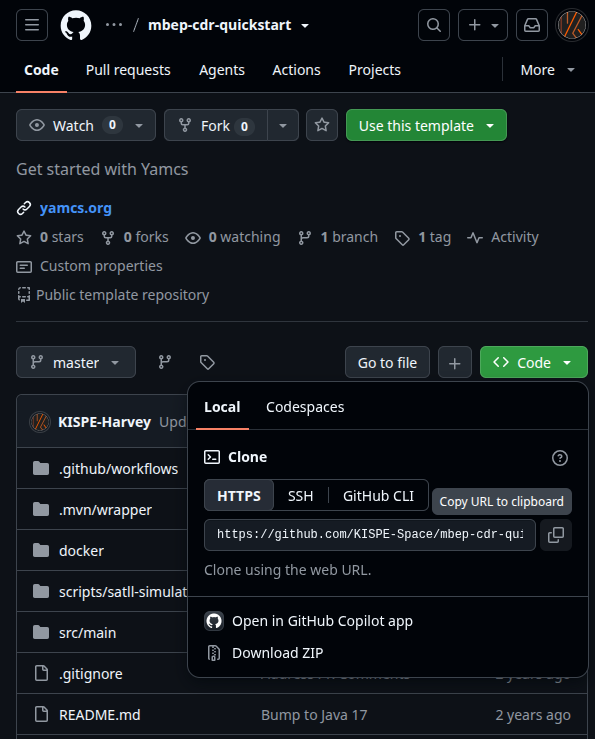 
</p>
<div class="page-break"></div>

Once downloaded the `.tar.gz` can be extracted.
Extract the `.tar.gx` file to your machine.

```bash
tar -xzf mbep-cdr-yamcs-0.0.1-CDR-bundle.tar.gz -C /PATH/ON/COMPUTER
```
Then enter the directory of the extracted file, where running the `ls` command should show a directory called `bin`.
If `bin` is visible run the command:
```bash
./bin/yamcsd
```
on Windows:
```bash
bin\yamcsd.bat
```

This command should then show the following outputs:

<p align="center"> 
    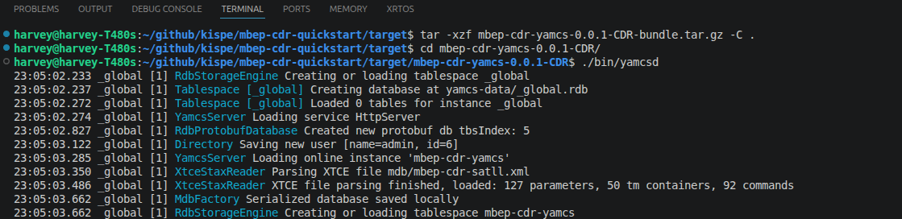 
</p>

<p align="center"> 
    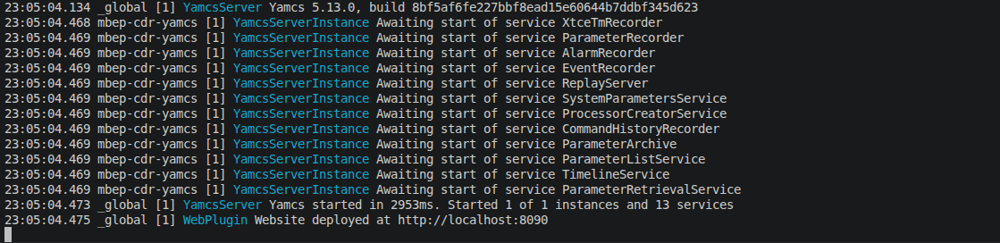 
</p>

This states, due to configuration of this instance, YAMCS is hosted on the user's computer at `http://localhost:8090`.

### Connecting to YAMCS
As mentioned YAMCS runs as a server on the machine, running the command `./bin/yamcsd` runs this service. As shown in Image 2, to access the server/web interface visit http://localhost:8090 or can be accessed by `ctrl + click` the terminal output.

This should bring up the YAMCS web interface. This is the default screen:
<p align="center"> 
    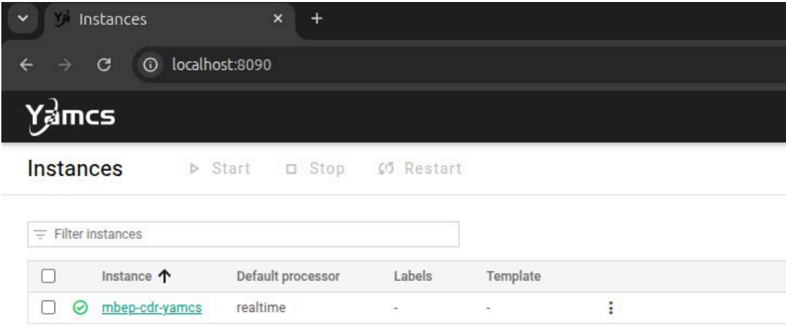 
</p>

## Viewing Parameters
YAMCS parses the database which contains all of the expected datatypes and parameters. They can be seen in the Telemetry/Parameters section.


<p align="center"> 
    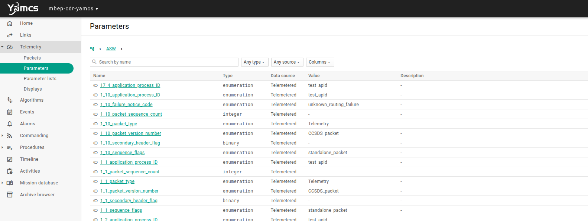 
</p>

For this example the added parameters have the prefix `onboard`:
<p align="center"> 
    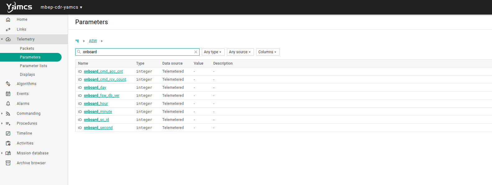 
</p>

## Viewing Available Commands
Commands can be sent from YAMCS and are available in the `Commanding/Send a command` section.
Commands can be configured to invoke specific actions and can request acknowledgements from the simulator.

<p align="center"> 
    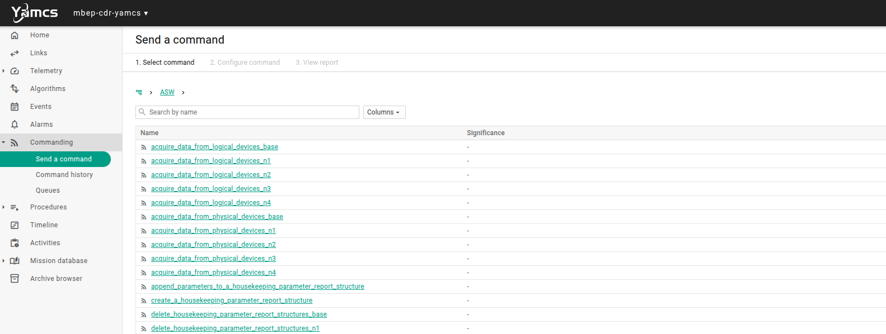 
</p>

Configuring a command:
<p align="center"> 
    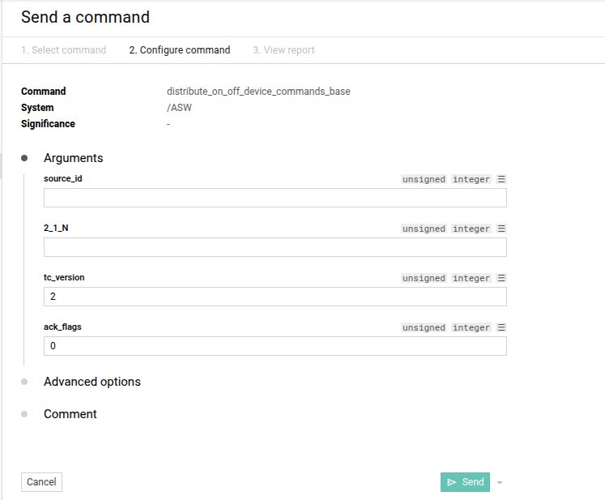 
</p>

for the ack flags:

|              | Acceptance Request | Start Request | Progress Request | Completion Request |
| ------------ | ------------------ | ------------- | ---------------- | ------------------ |
| Successful   | TM[1,1]            | TM[1,3]       | TM[1,5]          | TM[1,7]            |
| Unsuccessful | TM[1,2]            | TM[1,4]       | TM[1,6]          | TM[1,8]            |
As per the SATLL ICD, the simulator only supports TM[1,1] and TM[1,7] responses (and corresponding unsuccessful).

For both an `Acceptance Request` and a `Compleition Request`. The `ack_flags` should be :

| Acceptance Request | Compleition Request | Binary | Decimal |
| ------------------ | ------------------- | ------ | ------- |
| 0                  | 0                   | 0000   | 0       |
| 1                  | 0                   | 1000   | 8       |
| 0                  | 1                   | 0001   | 1       |
| 1                  | 1                   | 1001   | 9       |

A history of Command send is saved and can be inspected by the user.
## Running the simulator
The Github repo also contains a precompiled version of the simulator for ease of running, along with the source code and make files needed to recompile the code.

To run the simulator navigate to the `/scripts/satll-simulator` directory. To run the simulator run the command `./satll-sim`. This should be run in  a terminal which will output to the terminal the data being sent. 

<p align="center"> 
    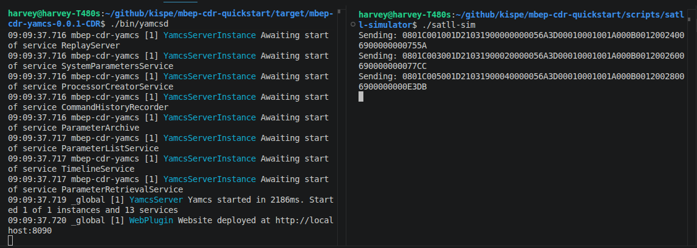 
</p>

## Live Telemetry
Live telemetry should now be coming into YAMCS via the UDP port. LIve telemetry and packets can be viewed in the `Telemetry/Packets` tab. Packets are time stamped and the raw data can be extracted and viewed:

<p align="center"> 
    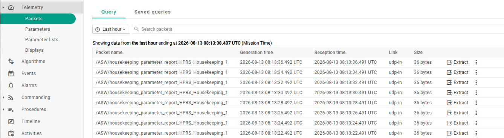 
</p>


<p align="center"> 
    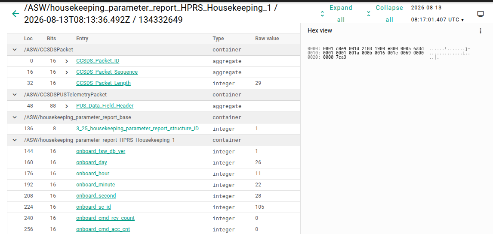 
</p>

The same parameter viewed in the parameters tab will show the latest updated value.
The status and activity of the input ports to YAMCS can be viewed in the `Links` tab:

<p align="center"> 
    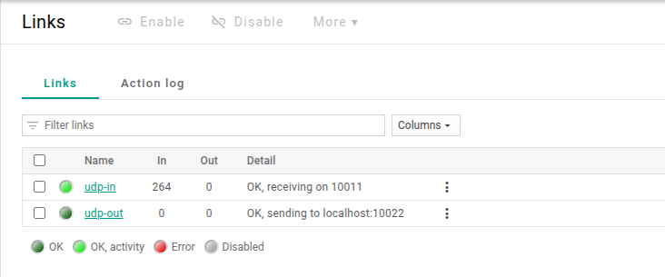 
</p>

## NOTE
Please note this is still an experimental release of the software as a proof of concept using YAMCS with SATLL. Any issues or feedback or useful ideas please contact `hnixon@kispe.co.uk`.
This software and setup has been tested and ran on Ubuntu systems and is known to work. YAMCS can be run on windows but it has not been tested in this configuration.

<p align="center"> 
     
</p>